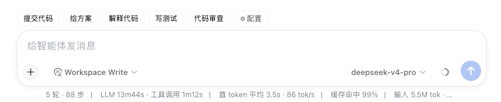
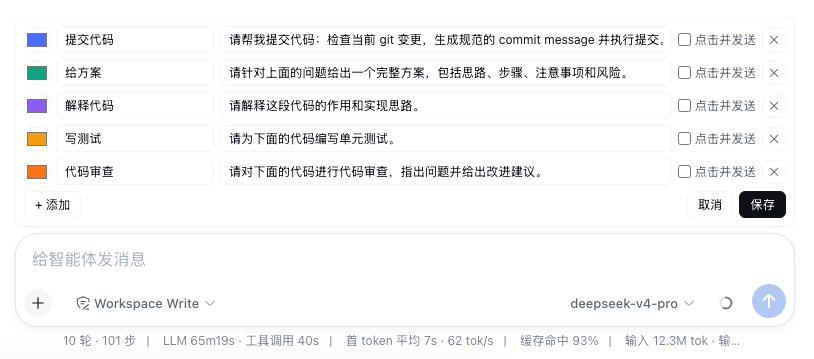

# quick-prompts · Composer quick prompts

🌐 [中文](README.md)

A row of quick-prompt chips above the DeepSeek Harness composer: click to fill a preset prompt into the input, or send it directly.





## Features

- Built-in prompts (Commit code / Give a plan / Explain code / Write tests / Code review), fully editable
- Click to fill the input; per-item "send on click" toggle
- Per-item color, zh/en bilingual UI, light/dark adaptive
- Config persisted to browser localStorage

## Install

```bash
dsh plugin --profile web add dsh-quick-prompts
# restart dsh web, then refresh the page
```

For local install or uninstall, see [formal/INSTALL.en.md](./formal/INSTALL.en.md).

## License

[MIT](./LICENSE)
